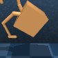

# DMC environment hacking
```python
import os
from pathlib import Path
import tempfile

import numpy as np
import dm_control
from dm_control.mujoco.wrapper import core
from dm_control.mujoco.wrapper.mjbindings import mjlib
import gym

import matplotlib.pyplot as plt
from ml_logger import ML_Logger

loader = ML_Logger(prefix="/model-free-examples/model-free-examples/")

colors = ['#ff7575', '#23aaff', '#66c56c', '#f4b247']

with doc:
    def plot_line(path, color, label, x_key, y_key, linestyle='-'):
        mean, low, high, step, = loader.read_metrics(f"{y_key}@mean",
                                                     f"{y_key}@16%",
                                                     f"{y_key}@84%",
                                                     x_key=f"{x_key}@min", path=path, dropna=True)
        plt.xlabel('Frames', fontsize=18)
        plt.ylabel('Rewards', fontsize=18)

        plt.plot(step.to_list(), mean.to_list(), color=color, label=label, linestyle=linestyle)
        plt.fill_between(step, low, high, alpha=0.1, color=color)
```

```python
def plot_line(path, color, label, x_key, y_key, linestyle='-'):
    mean, low, high, step, = loader.read_metrics(f"{y_key}@mean",
                                                 f"{y_key}@16%",
                                                 f"{y_key}@84%",
                                                 x_key=f"{x_key}@min", path=path, dropna=True)
    plt.xlabel('Frames', fontsize=18)
    plt.ylabel('Rewards', fontsize=18)

    plt.plot(step.to_list(), mean.to_list(), color=color, label=label, linestyle=linestyle)
    plt.fill_between(step, low, high, alpha=0.1, color=color)
```
```python
env = gym.make('lcs:Walkermod-stand-v1')
env.reset()
env.seed(42)
img = env.render('rgb_array')
r = doc.table().figure_row()
r.figure(img, f"{Path(__file__).stem}/walkermod.png", zoom="400%", title="Walkermod", caption="")
```

| **Walkermod** |
|:-------------:|
|  |
|  |
## Run simulation
```python
position_history = []
for _ in range(100):
    action = np.full(env.action_space.shape, 0.0)
    obs, reward, done, info = env.step(action)
    position_history.append(obs)
```

